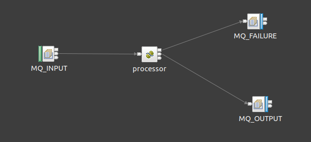

# IIB Gradle Plugin (Beta)

This is a gradle plugin to allow developers to package their Java code
up as a BAR file for deployment to the IBM Integration Bus. It's meant as a way to avoid using the 
IBM Integration Toolkit for JVM developers.

The motivation behind this is due to the majority of my workflows being mostly InputNode -> JavaComputeNode [ -> OutputNode ]

Here's some sample code of 1.0 functionality:

```kotlin
bar("sample") {
    createMessageFlow("sample_message_flow") {
        processingNode("App") {
            input = MQInputNode("MQ_INPUT", "INPUT_QUEUE").apply {
                browse = true
            }
            
            out = MQOutputNode("MQ_OUTPUT", "OUTPUT_QUEUE")
            
            failure = MQOutputNode("MQ_FAILURE", "FAILURE_QUEUE")
        }
    }
}
```

This will compile a bar file called `sample.bar` in the `build/libs` directory, with a message flow equivalent
to this:



It is recommended to write your gradle build file in Kotlin DSL. You can write your application code in any JVM language 
that produces Java 8 compatible bytecode. 

Here's the `com.sample.App` JavaCompute node referenced above:

```java
public class App extends JSONProcessor {


    public App() {
        super("App");
    }

    @Override
    protected void processArray(@NotNull JSONArrayMessage jsonArrayMessage) throws ProcessingError {

    }

    @Override
    protected void processObject(@NotNull JSONObjectMessage jsonObjectMessage) throws ProcessingError {

    }
}
```

This is written using the [iib-java-toolkit](https://github.com/sultanofcardio/iib-java-toolkit) library which allows 
for easy message processing in Java based on the message parser domain (JSON, XML, CSV, TEXT, BLOB).

## Supported Nodes

### Input
* MQInputNode

### Processing
* JavaComputeNode

### Output
* MQOutputNode

## Roadmap

### Eject

The addition of an `eject` task that can produce an IIB Toolkit compatible
project in case you ever want to transition your code to the toolkit. This would only work if 
your application code is written in Java at language level 7 (the toolkit can only compile Java 7 code).

### Deployment

The addition of a `deploy` task to deploy project code directly to IIB from gradle.

### Debugging

The creation of an IntelliJ plugin that supports debugging IIB code compiled with this gradle plugin

